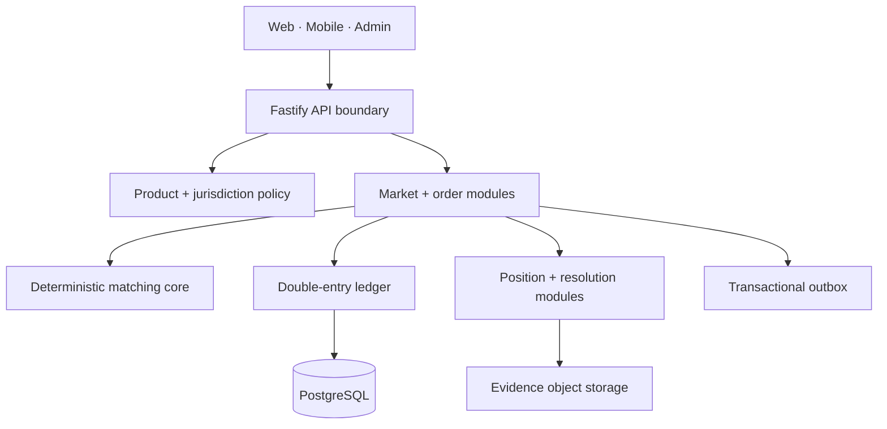

# ADR-001: Sandbox-first modular monolith

Status: accepted · 2026-07-30

## Decision

Kynorix starts as a TypeScript modular monolith around explicit domain
boundaries, with a separately testable deterministic matching core. Public,
operations and mobile clients consume the same versioned contracts. PostgreSQL
is the source of truth in deployed environments; the delivered demo adapter is
in-memory so the sandbox can run without financial infrastructure.

The first enabled products are:

- `virtual_prediction`
- `b2b_private_prediction`

Real-money prediction, spot crypto, custody, fiat/crypto transfer,
five-minute UP/DOWN, binary options and financial gold exposure are denied by
server policy. Their product definitions remain registered so a future approved
implementation cannot confuse product classifications.

## Domain boundaries

No client decides eligibility, balance, matching, fees, resolution or
settlement. Those decisions are authoritative server operations.

## Atomic production path

The in-memory adapter demonstrates invariants. The PostgreSQL adapter must place
the following in one serializable transaction:

1. Lock user/order/position rows in canonical order.
2. Validate tenant, product, market, status, price, quantity and limits.
3. Reserve money or outcome units.
4. Persist order and its idempotency fingerprint.
5. Commit deterministic match outputs with a unique book sequence.
6. Post balanced ledger entries and update positions.
7. Persist outbox events.
8. Commit.

The matching partition has one authoritative writer. A failed transaction does
not publish an event and the input can be replayed by idempotency key.

## Extraction threshold

A module becomes a service only when independent scaling, failure isolation or
regulatory separation justifies the operational cost. Matching, price index,
notifications and analytics are the expected first extractions.
